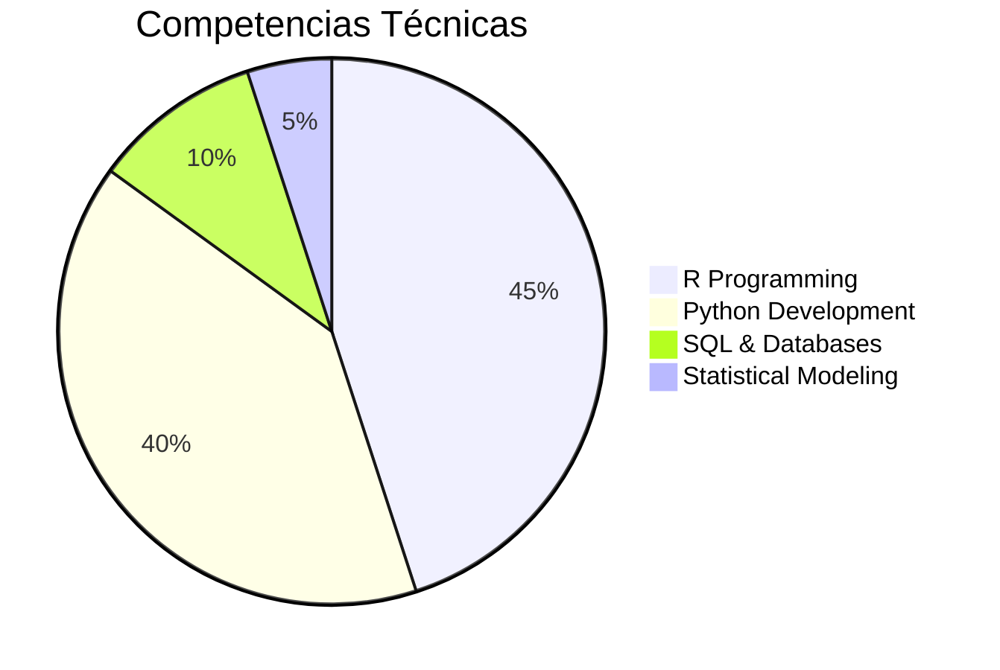
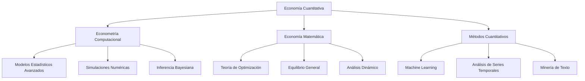
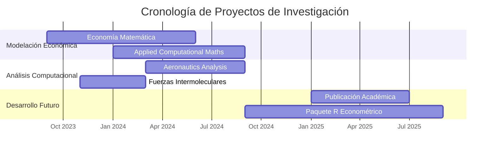
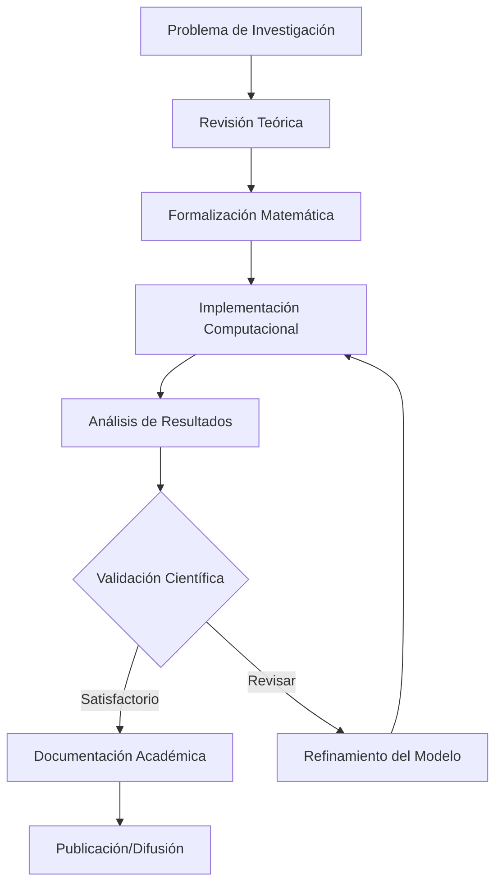

# EMANUEL QUINTANA SILVA
#### Economista en Formación · Investigador Computacional
##### Universidad Pedagógica y Tecnológica de Colombia

---

## Perfil de Investigación

Mi trabajo se sitúa en la intersección de la **economía teórica**, las **matemáticas aplicadas** y la **computación científica**. Me especializo en el desarrollo e implementación de métodos econométricos avanzados, utilizando lenguajes de programación estadística como R y Python para abordar problemas complejos en ciencias sociales cuantitativas.

Mi enfoque combina rigor matemático con aplicaciones prácticas, desarrollando herramientas computacionales que permiten analizar fenómenos económicos desde perspectivas innovadoras, integrando teoría económica clásica con técnicas modernas de análisis de datos.

---

## Visualización de Competencias

### Distribución de Habilidades Técnicas

### Áreas de Especialización

---

## Áreas de Investigación

**Econometría Computacional**  
Desarrollo de modelos econométricos utilizando métodos computacionales avanzados para estimación, inferencia y predicción en datos económicos.

**Economía Matemática**  
Formalización matemática de problemas económicos, teoría de optimización y análisis de equilibrio general en sistemas económicos complejos.

**Métodos Cuantitativos**  
Aplicación de técnicas estadísticas avanzadas y machine learning para análisis de datos en ciencias sociales y economía aplicada.

**Modelación Computacional**  
Simulaciones numéricas y modelos basados en agentes para estudiar dinámicas económicas, fenómenos emergentes y sistemas complejos.

---

## Métricas de Investigación

### Estadísticas de Actividad

| | | |
|---|---|---|
| **5+** Repositorios | **4** Proyectos Activos | **3** Seguidores | **100+** Commits |

---

## Proyectos de Investigación

### 📊 Applied Computational Mathematics (2024)
**Descripción:** Implementación de algoritmos computacionales para resolver problemas de optimización económica, ecuaciones diferenciales y análisis numérico aplicado a modelos macroeconómicos dinámicos.

**Tecnologías:** Numerical Analysis, Optimization, Python  
**Repositorio:** [github.com/emanuelquintana-glitch/APPLIED_-_COMPUTATIONAL_MATHS](https://github.com/emanuelquintana-glitch/APPLIED_-_COMPUTATIONAL_MATHS.git)

###  Economía Matemática: Apuntes y Desarrollos (2023-2024)
**Descripción:** Compilación sistemática de teoremas, demostraciones y aplicaciones en economía matemática, cubriendo desde fundamentos de análisis hasta teoría del equilibrio general y optimización dinámica.

**Tecnologías:** Mathematical Economics, Theory, LaTeX  
**Repositorio:** [github.com/emanuelquintana-glitch/Apuntes-Economia-Matematica](https://github.com/emanuelquintana-glitch/Apuntes-Economia-Matematica.git)

###  Aeronautics: Computational Analysis (2024)
**Descripción:** Análisis computacional interdisciplinario aplicando métodos matemáticos y simulaciones estadísticas para modelar fenómenos en dinámica de fluidos y sistemas complejos aeronáuticos.

**Tecnologías:** Computational Modeling, Simulations, R  
**Repositorio:** [github.com/emanuelquintana-glitch/Aeronautics_1](https://github.com/emanuelquintana-glitch/Aeronautics_1.git)

###  Teoría de Fuerzas Intermoleculares (2023)
**Descripción:** Estudio computacional de interacciones moleculares mediante métodos numéricos, aplicando técnicas de simulación para modelar comportamientos físico-químicos en sistemas complejos.

**Tecnologías:** Computational Physics, Numerical Methods, Python  
**Repositorio:** [github.com/emanuelquintana-glitch/TEORIA_DE_FUERZAS_INTERMOLECULARES](https://github.com/emanuelquintana-glitch/TEORIA_DE_FUERZAS_INTERMOLECULARES.git)

---

## Metodologías y Herramientas

- **R Programming** - Análisis estadístico avanzado
- **Python** - Modelado y machine learning
- **Statistical Modeling** - Modelos econométricos
- **Time Series Analysis** - Series temporales económicas
- **Optimization Theory** - Optimización matemática
- **Machine Learning** - Algoritmos predictivos
- **LaTeX** - Documentación académica
- **Numerical Methods** - Métodos numéricos
- **Data Visualization** - Visualización científica
- **Version Control (Git)** - Control de versiones

---

## Flujo de Trabajo de Investigación

---

## Identificadores y Contacto

### Identificadores Académicos
- **ORCID:** [0009-0006-8419-2805](https://orcid.org/0009-0006-8419-2805)
- **GitHub:** [@emanuelquintana-glitch](https://github.com/emanuelquintana-glitch)

### Información de Contacto
- **Email Institucional:** emanuel.quintana@uptc.edu.co
- **Institución:** Universidad Pedagógica y Tecnológica de Colombia
- **Área:** Economía Cuantitativa y Computacional

---

## Estadísticas de GitHub

---

## Declaración de Enfoque

*"La investigación en economía computacional representa la convergencia entre el rigor matemático de la teoría económica y el poder transformador de la ciencia de datos. Mi trabajo busca construir puentes metodológicos entre estas disciplinas, desarrollando herramientas que no solo expliquen fenómenos económicos, sino que también anticipen dinámicas complejas en sistemas sociales."*

**Emanuel Quintana Silva**  
Economista en Formación, UPTC  
Última actualización: Diciembre 2024

---
