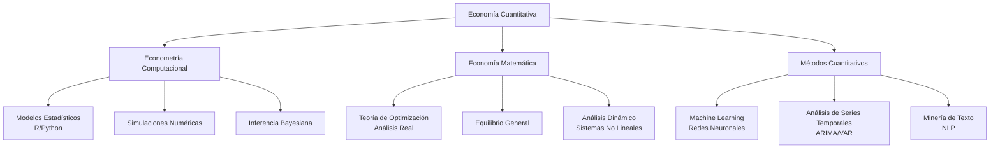
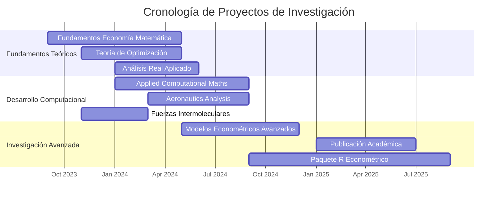

<!-- SVG Económico Animado - Compatible con GitHub -->
<svg width="100%" height="150" xmlns="http://www.w3.org/2000/svg">
    <defs>
        <linearGradient id="grad1" x1="0%" y1="0%" x2="100%" y2="0%">
            <stop offset="0%" style="stop-color:#0f1419;stop-opacity:1" />
            <stop offset="100%" style="stop-color:#4a7c59;stop-opacity:0.8" />
        </linearGradient>
        
        <linearGradient id="grad2" x1="0%" y1="0%" x2="100%" y2="0%">
            <stop offset="0%" style="stop-color:#4a7c59;stop-opacity:0.6" />
            <stop offset="100%" style="stop-color:#6b9e78;stop-opacity:0.3" />
        </linearGradient>
    </defs>
    
    <!-- Curvas Económicas -->
    <path id="curve1" d="M0,75 Q100,50 200,75 T400,75 T600,75 T800,75 T1000,75" 
          fill="none" stroke="url(#grad1)" stroke-width="2" stroke-dasharray="10,5">
        <animate attributeName="d" 
                 values="M0,75 Q100,50 200,75 T400,75 T600,75 T800,75 T1000,75;
                         M0,75 Q100,60 200,70 T400,80 T600,70 T800,65 T1000,75;
                         M0,75 Q100,50 200,75 T400,75 T600,75 T800,75 T1000,75" 
                 dur="8s" repeatCount="indefinite" />
    </path>
    
    <path id="curve2" d="M0,85 Q150,100 300,85 T600,85 T900,85" 
          fill="none" stroke="url(#grad2)" stroke-width="1.5" stroke-dasharray="15,10">
        <animate attributeName="d" 
                 values="M0,85 Q150,100 300,85 T600,85 T900,85;
                         M0,85 Q150,95 300,90 T600,80 T900,85;
                         M0,85 Q150,100 300,85 T600,85 T900,85" 
                 dur="12s" repeatCount="indefinite" />
    </path>
    
    <!-- Puntos de Datos -->
    <circle cx="100" cy="75" r="3" fill="#6b9e78">
        <animate attributeName="cy" values="75;65;75" dur="4s" repeatCount="indefinite" />
        <animate attributeName="opacity" values="0.3;0.8;0.3" dur="4s" repeatCount="indefinite" />
    </circle>
    
    <circle cx="400" cy="75" r="3" fill="#4a7c59">
        <animate attributeName="cy" values="75;85;75" dur="5s" repeatCount="indefinite" begin="1s" />
        <animate attributeName="opacity" values="0.3;0.8;0.3" dur="5s" repeatCount="indefinite" begin="1s" />
    </circle>
    
    <circle cx="700" cy="75" r="3" fill="#7ab88f">
        <animate attributeName="cy" values="75;70;75" dur="6s" repeatCount="indefinite" begin="2s" />
        <animate attributeName="opacity" values="0.3;0.8;0.3" dur="6s" repeatCount="indefinite" begin="2s" />
    </circle>
</svg>

# EMANUEL QUINTANA SILVA

#### Economista en Formación · Investigador Computacional
##### Universidad Pedagógica y Tecnológica de Colombia

<!-- Badges Académicos Profesionales -->

---

## 01. Perfil de Investigación

Mi trabajo se sitúa en la intersección de la **economía teórica**, las **matemáticas aplicadas** y la **computación científica**. Me especializo en el desarrollo e implementación de métodos econométricos avanzados, utilizando lenguajes de programación estadística como R y Python para abordar problemas complejos en ciencias sociales cuantitativas.

Mi enfoque combina rigor matemático con aplicaciones prácticas, desarrollando herramientas computacionales que permiten analizar fenómenos económicos desde perspectivas innovadoras, integrando teoría económica clásica con técnicas modernas de análisis de datos.

---

## 02. Áreas de Investigación

### Econometría Computacional
Desarrollo de modelos econométricos utilizando métodos computacionales avanzados para estimación, inferencia y predicción en datos económicos.

### Economía Matemática
Formalización matemática de problemas económicos, teoría de optimización y análisis de equilibrio general en sistemas económicos complejos.

### Métodos Cuantitativos
Aplicación de técnicas estadísticas avanzadas y machine learning para análisis de datos en ciencias sociales y economía aplicada.

### Modelación Computacional
Simulaciones numéricas y modelos basados en agentes para estudiar dinámicas económicas, fenómenos emergentes y sistemas complejos.

---

## 03. Metodologías y Herramientas

### Lenguajes de Programación
  

### Análisis Estadístico
  

### Visualización Científica
  

### Herramientas Académicas
  

---

## 04. Proyectos de Investigación

### Applied Computational Mathematics (2024)
**Descripción:** Implementación de algoritmos computacionales para resolver problemas de optimización económica, ecuaciones diferenciales y análisis numérico aplicado a modelos macroeconómicos dinámicos.

**Tecnologías:** `Numerical Analysis` `Optimization` `Python`  
**Repositorio:** [github.com/emanuelquintana-glitch/APPLIED_-_COMPUTATIONAL_MATHS](https://github.com/emanuelquintana-glitch/APPLIED_-_COMPUTATIONAL_MATHS.git)

### Economía Matemática: Apuntes y Desarrollos (2023-2024)
**Descripción:** Compilación sistemática de teoremas, demostraciones y aplicaciones en economía matemática, cubriendo desde fundamentos de análisis hasta teoría del equilibrio general y optimización dinámica.

**Tecnologías:** `Mathematical Economics` `Theory` `LaTeX`  
**Repositorio:** [github.com/emanuelquintana-glitch/Apuntes-Economia-Matematica](https://github.com/emanuelquintana-glitch/Apuntes-Economia-Matematica.git)

### Aeronautics: Computational Analysis (2024)
**Descripción:** Análisis computacional interdisciplinario aplicando métodos matemáticos y simulaciones estadísticas para modelar fenómenos en dinámica de fluidos y sistemas complejos aeronáuticos.

**Tecnologías:** `Computational Modeling` `Simulations` `R`  
**Repositorio:** [github.com/emanuelquintana-glitch/Aeronautics_1](https://github.com/emanuelquintana-glitch/Aeronautics_1.git)

### Teoría de Fuerzas Intermoleculares (2023)
**Descripción:** Estudio computacional de interacciones moleculares mediante métodos numéricos, aplicando técnicas de simulación para modelar comportamientos físico-químicos en sistemas complejos.

**Tecnologías:** `Computational Physics` `Numerical Methods` `Python`  
**Repositorio:** [github.com/emanuelquintana-glitch/TEORIA_DE_FUERZAS_INTERMOLECULARES](https://github.com/emanuelquintana-glitch/TEORIA_DE_FUERZAS_INTERMOLECULARES.git)

---

## 05. Métricas de Actividad

| **5+** Repositorios | **4** Proyectos Activos | **3** Seguidores | **100+** Commits |
|---------------------|-------------------------|------------------|------------------|

### Estadísticas de GitHub

---

## 06. Visualización de Habilidades

---

## 07. Cronología Académica

---

## 08. Contacto e Identificadores

### Información Institucional
- **Nombre:** Emanuel Quintana Silva
- **Institución:** Universidad Pedagógica y Tecnológica de Colombia (UPTC)
- **Programa:** Economía
- **Email Institucional:** emanuel.quintana@uptc.edu.co

### Identificadores Académicos
- **ORCID:** [0009-0006-8419-2805](https://orcid.org/0009-0006-8419-2805)
- **GitHub:** [@emanuelquintana-glitch](https://github.com/emanuelquintana-glitch)

### Redes Profesionales
- **Perfil Académico:** [UPTC Research Portal](https://www.uptc.edu.co/)
- **Repositorios:** [GitHub Profile](https://github.com/emanuelquintana-glitch)

---

## 09. Declaración de Investigación

> "La investigación en economía computacional representa la convergencia entre el rigor matemático de la teoría económica y el poder transformador de la ciencia de datos. Mi trabajo busca construir puentes metodológicos entre estas disciplinas, desarrollando herramientas que no solo expliquen fenómenos económicos, sino que también anticipen dinámicas complejas en sistemas sociales."

**Emanuel Quintana Silva**  
Economista en Formación, Universidad Pedagógica y Tecnológica de Colombia  
Última actualización: Diciembre 2024

---

### Investigación en Econometría Computacional y Ciencias Sociales Cuantitativas

